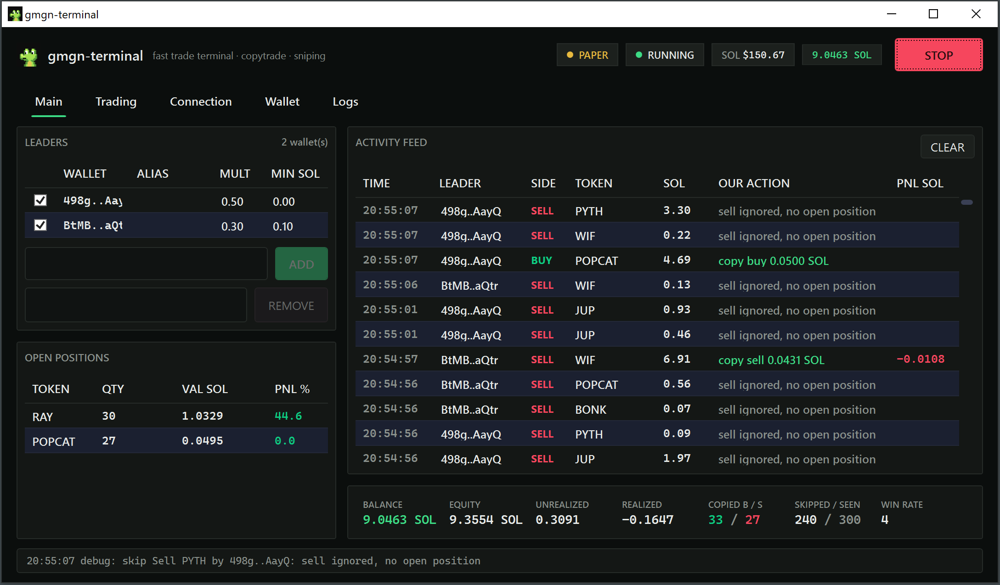

# GMGN-terminal

Solana memecoin terminal, copytrade whales, snipe launches, watch positions
from one window.

Copied wallets by hand from gmgn for months. Misclicks cost me more than
fees ever did. So now the terminal clicks for me.

**WARN!! Copytrading memecoins rugs hard. One bad "smart money" wallet and the bot
copies the rug faithfully. Fresh wallet, small balance, never your main key.**

## Install from release

1. Get binaties from [Releases](https://github.com/BikeTysonDegen/gmgn-terminal-bot/releases), unpack wherever.
2. First start drops config.json next to it and
   seeds two wallets from gmgn 7d profit rank.
3. START on Main tab. feed moves, paper pnl counts. done.

## Install from sources (build yourself)

    git clone https://github.com/BikeTysonDegen/gmgn-terminal-bot.git
    cd gmgn-terminal-bot/src
    dotnet run --project GmgnTerminal.App

## What it does

- Polls leader wallets activity on gmgn, copies real fills. buys and sells
- Buy size: fixed SOL, or leader size x multiplier per wallet
- Sells proportional to your bag. leader trims a third, you trim a third.
  leader dumps everything, you close
- Filters: min leader sol, max our sol, max open positions, skip mints,
  random delay so you dont land in the same block as fifty other copiers
- Paper broker: slippage + fee sim, realized/unrealized pnl, session stats
- Offline feed: half of gmgn endpoints 403 plain http clients (cloudflare
  tls fingerprint). offline mode replays real mints locally so you can test
  the whole loop without network
- Logs everything to a file next to exe, plus a log tab in the app

## Picking addresses

gmgn rank, smart money lists, top traders on tokens that actually ran.
early entries, staged sells, holds over 30s, 50%+ winrate over 20 trades.
one-tx buy-and-dump wallets are bundlers, skip.

## Known issues

- Wallet activity 403s from datacenter ips. residential proxy or offline feed
- Leader bag tracked from engine start only. sells on older bags = full exit
- Wpf datagrid eats first click sometimes. wpf being wpf

MIT.
